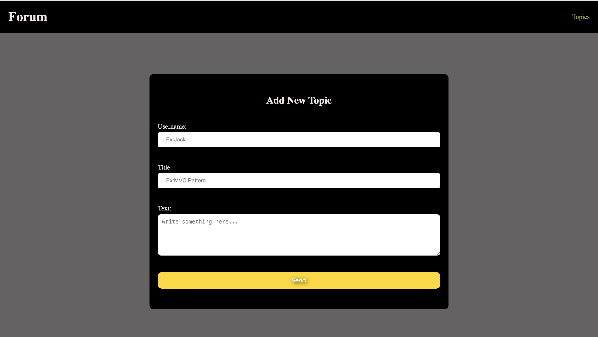
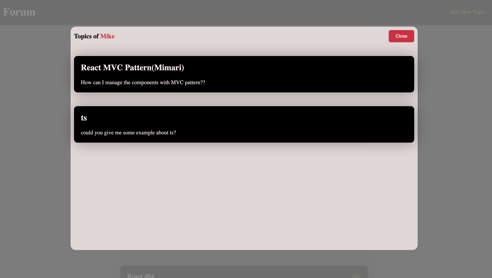

# MVC ( Model View Controller)

### Model : Uygulamanın veri mantığını | veri yapisini temsil eder.

- Örn: Projede state'inin tutucağımız bir formun obje şeklinde değerleri. {name:,mail: etc}

### View : Kullanıcı arayüzünü temsil eder.

- JSX Kodları burada yazılır (div,form,header)

### Controller: Model ve View Arasında iletişim kurar.

- Kullanici etkilesiminde calisacak fonksiyonlar, Api istekleri burada tutulur.

# Libraries Used:

- vite >> (npm create vite )

- axios

- react-router-dom >>

```
return <BrowserRouter>
  <Routes>
    <Route path="/" element= {<ListPostsController />} />
  </Routes>
  </BrowserRouter>;

  <!-- Controller, view ve model arasinda baglanti kuruyor.Ekrana o yuzden onu basiyoruz -->
```

- json-server >>
  (package.json>>scripts>> add>> `"server": "json-server --w db.json --p 3000"` )

- sass >> (npm i sass(terminal))

- uuid >>(npm i uuid(terminal))

# Yapılacaklar

- Api blog verilerini al >>( `Controller`)

- Her blog verisi için ekrana kart bas >> (`View`)

- Bir form arayüzü oluştur >> (`View`)

- Formdaki inputlar değiştiğinde state'lerini tut >> ( `Controller`)

- State tutulucak değerleri belirle >> (`Model`)

- Gönderildiğinde post'u api'ye gönder ve kullanıcyı yönlendir >> ( `Controller`)

##SCREEN GIF


##SCREEN VIEW







